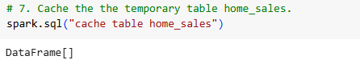
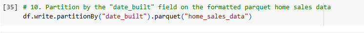
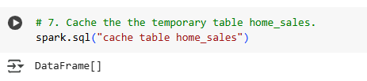
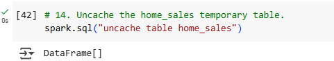

# Home Sales
---
The goal of this repository is to illustrate knowledge of SparkSQL.

---

Home_Sales_colab - jupyter notebook demonstrating knowledge of SparkSQL.

    - To run locally
        - Make sure all dependencies are installed, such  as Java, pyspark, findspark,PyArrow and Fastparquet. 
        - In Home_Sales_colab remove this from first notebook:
        

                import os
                # Find the latest version of spark 3.x  from http://www.apache.org/dist/spark/ and enter as the spark version
                # For example:
                # spark_version = 'spark-3.5.3'
                spark_version = 'spark-3.5.3'
                os.environ['SPARK_VERSION']=spark_version

                # Install Spark and Java
                !apt-get update
                !apt-get install openjdk-11-jdk-headless -qq > /dev/null
                !wget -q http://www.apache.org/dist/spark/$SPARK_VERSION/$SPARK_VERSION-bin-hadoop3.tgz
                !tar xf $SPARK_VERSION-bin-hadoop3.tgz
                !pip install -q findspark

                # Set Environment Variables
                os.environ["JAVA_HOME"] = "/usr/lib/jvm/java-11-openjdk-amd64"
                os.environ["SPARK_HOME"] = f"/content/{spark_version}-bin-hadoop3"

       

-   SparkSQL examples:

    -  creating temporary views
    
    
    - Partitioning the data
    

    - Cache temporary table
    

    - Uncache temporary table
    

                        
